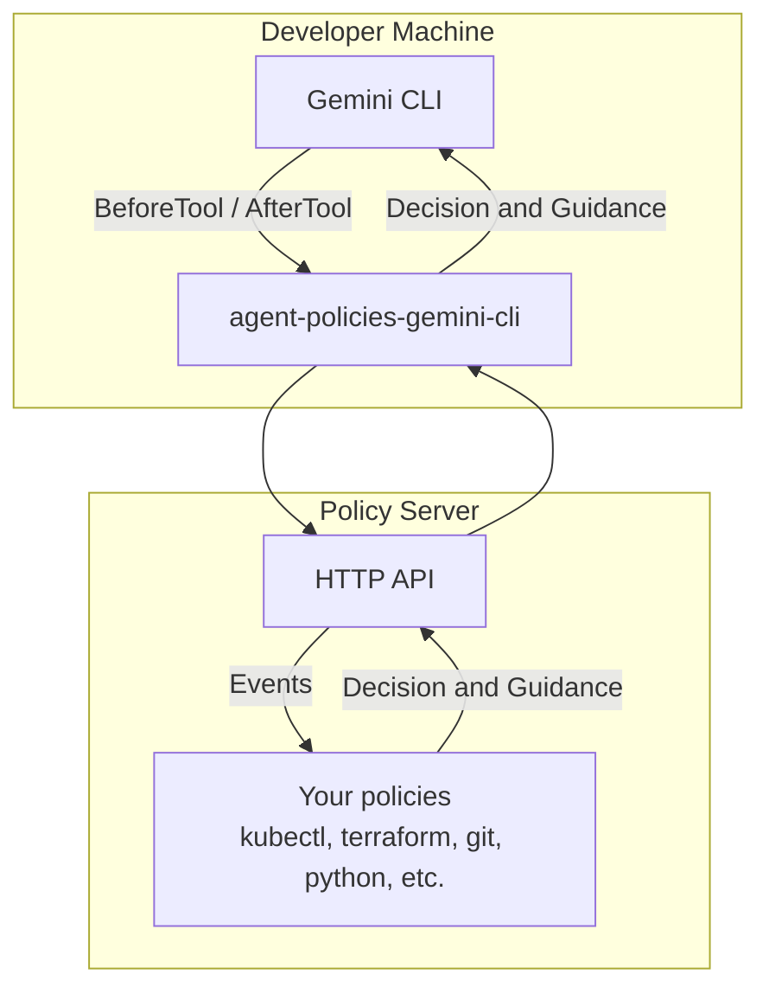

# agent-policies-gemini-cli

Policies allow your rules, often in natural language, to be expressed as policies; code. The policies are strict guardrails an AI Agent cannot bypass or disregard. Policies allow you to automate decisionmaking as well as guidance for AI Agents, letting them self-correct without interruption.

> This repository contains only the Gemini CLI client. For the server reference implementation, see [agent-policies-server](https://github.com/Devleaps/agent-policies-server).

## Installation

Install the extension and register hooks:

```bash
gemini extensions install https://github.com/Devleaps/agent-policies-gemini-cli
node ~/.gemini/extensions/agent-policies/scripts/hooks-add.js
```

Remove hooks and uninstall:

```bash
node ~/.gemini/extensions/agent-policies/scripts/hooks-remove.js
gemini extensions uninstall agent-policies
```

## Architecture



## Configuration

`~/.agent-policies/config.json`:

```jsonc
{
  // Policy server endpoint. Default: "http://localhost:8338"
  "server_url": "https://agent-policies.devleaps.nl",

  // Policy bundles to activate. Default: ["universal"]
  "bundles": ["universal", "python", "git"],

  // What to do when the server returns no decision: "allow", "ask", "deny". Default: "ask"
  "default_policy_behavior": "ask"
}
